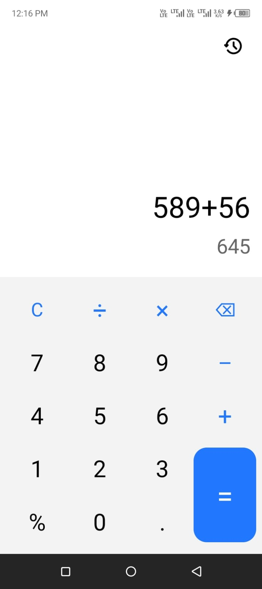
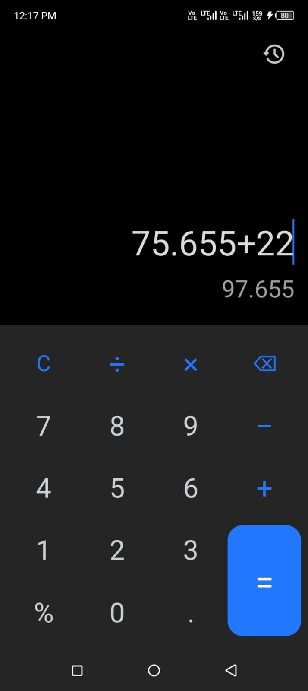
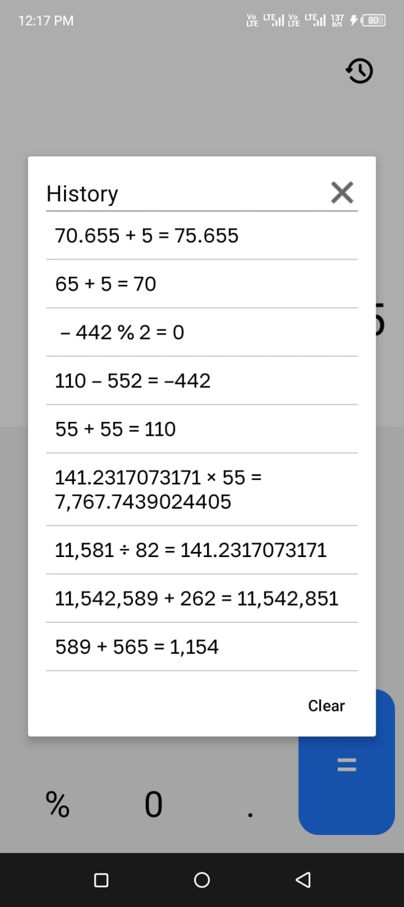
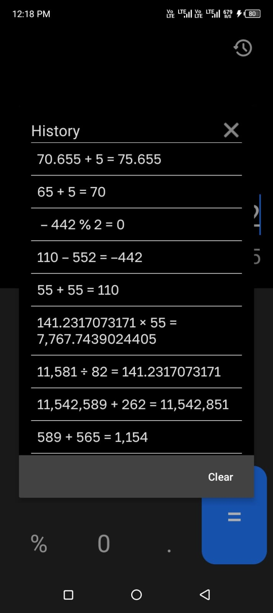
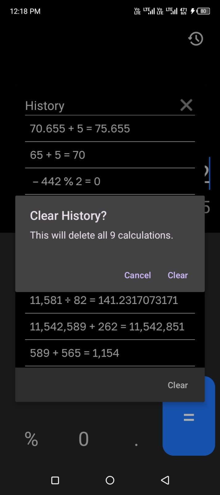

📱 Kotlin Calculator App

A fully functional Calculator App built using Kotlin, XML, and SQLite.
The app performs all basic arithmetic operations and stores calculation history locally using SQLite.

🚀 Features
➕ Addition, subtraction, multiplication, division
📝 View calculation history
💾 History stored locally using SQLite database
🗑 Clear full history
🎨 Clean and simple UI
⚡ Fast & lightweight

🖼 Screenshots

| Component    | Technology      |
| ------------ | --------------- |
| Language     | Kotlin          |
| UI           | XML Layouts     |
| Database     | SQLite          |
| Architecture | MVVM (optional) |
| IDE          | Android Studio  |

📂 Project Structure
app/
├── java/
│   └── com.caldb.calculator/
│       ├── MainActivity.kt
│       ├── HistoryActivity.kt
│       ├── HistoryDatabase.kt
│       └── adapters/
├── res/
│   ├── layout/
│   ├── drawable/
│   └── values/

📦 Installation
Clone the repository
git clone https://github.com/malijoya/Calculator.git

Open in Android Studio
Run on device or emulator

📝 License
This project is licensed under the MIT License — free to use, modify, and distribute.
MIT License
Copyright (c) 2025 Muhammad Ali Joya
Permission is hereby granted, free of charge, to any person obtaining a copy...

👨‍💻 Author
Muhammad Ali Joya
Android Developer | Kotlin | Firebase | Jetpack Compose